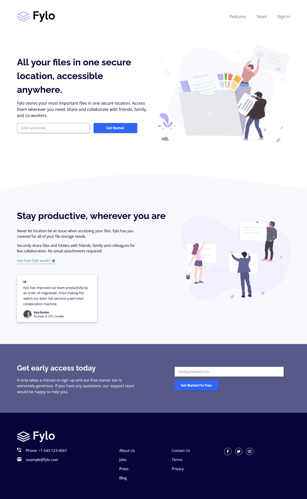

# Frontend Mentor - Fylo landing page with two column layout solution

This is a solution to the [Fylo landing page with two column layout challenge on Frontend Mentor](https://www.frontendmentor.io/challenges/fylo-landing-page-with-two-column-layout-5ca5ef041e82137ec91a50f5). Frontend Mentor challenges help you improve your coding skills by building realistic projects. 

## Table of contents

- [Overview](#overview)
  - [The challenge](#the-challenge)
  - [Screenshot](#screenshot)
  - [Links](#links)
- [My process](#my-process)
  - [Built with](#built-with)
  - [What I learned](#what-i-learned)
  - [Continued development](#continued-development)
  - [Useful resources](#useful-resources)
- [Author](#author)

## Overview

### The challenge

Users should be able to:

- View the optimal layout for the site depending on their device's screen size
- See hover states for all interactive elements on the page

### Screenshot

### Links

- Live Site URL: [Add live site URL here](https://your-live-site-url.com)

## My process

### Built with

- Semantic HTML5 markup
- CSS custom properties
- Flexbox
- CSS Grid

### What I learned

I didn't learn anything crucial for my knowledge in HTML or CSS, but I sure made some mistakes along the way. There are inconsistencies in my code, and a lot of media query breakpoints that made my work look kind of messy.  I wish I had planned more on how the layout would change as it transition to mobile view for a cleaner code.

### Continued development

From here on, I'm going to start doing project that involves JS while expanding my knowledge in HTML and CSS.

### Useful resources

- [MDN Web Docs](https://developer.mozilla.org/en-US/) - This is where I go everytime I need reference.
- [Kevin Powell](https://www.youtube.com/kepowob) - I picked up some tricks and ideas from the way he does CSS.

## Author
- Frontend Mentor - [@arey-dev](https://www.frontendmentor.io/profile/arey-dev)
